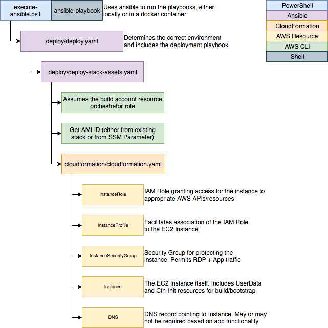

# Skeleton - Infrastructure as Code

This is a reference repository to help accelerate the setup of applications in AWS.

For more info - see https://johnholland.atlassian.net/wiki/spaces/JHGD/pages/91226186/General+EC2+Hosts+Guide

The focus is on fairly traditional, Windows hosted, non-elastic, mutable infra requirements. Adapt as required. Feedback encouraged.

## How to use this skeleton repo

- Clone this repo, deleting the `.git` directory and recreating with `git init .`

## Deploy

### From Windows

#### Production

`PS> .\execute-ansible.ps1 -aws_profile prod -aws_region ap-southeast-2 -environment prod`

#### Non-Production

`PS> .\execute-ansible.ps1 -aws_profile nonprod -aws_region ap-southeast-2 -environment nonprod`

#### Development

`PS> .\execute-ansible.ps1 -aws_profile sandpit -aws_region ap-southeast-2 -environment dev`

Note that instances cannot join the Active Directory domain `jhg.com.au` from Sandpit, and as a result, deployments may fail.

### From macOS/Linux

#### Production

`$ AWS_PROFILE=prod ansible-playbook -i inventory -c local deploy/deploy.yaml -e "deploy_env=prod"`

#### Non-Production

`$ AWS_PROFILE=nonprod ansible-playbook -i inventory -c local deploy/deploy.yaml -e "deploy_env=nonprod"`

#### Development

`$ AWS_PROFILE=sandpit ansible-playbook -i inventory -c local deploy/deploy.yaml -e "deploy_env=dev"`

Note that instances cannot join the Active Directory domain `jhg.com.au` from Sandpit, and as a result, deployments may fail.

## Deployment Architecture

The basic deployment architecture of this repository should be maintained wherever possible and is as follows ([draw.io source](docs/deployment-architecture.xml)):

## Modifying the repository

The general pattern of the repository should be maintained where possible to facilitate consistency
across the organisation. Update the sections as detailed below where necessary:

### Update Content

#### `README.md`

Update this to refer to the specific application and add any more details required

#### `cloudformation/cloudformation.yaml`

Update the cloudformation, including the addition of any parameters as necessary. Pay particular
attention to `InstanceSecurityGroup`'s ingress rules, and to the install/deploy scripts as part 
of `Instance`.

#### `deploy/deploy-stack-assets.yaml`

- Update the first `set_fact` block's variables
  - Update `Service` to be the service's name
  - Update `Application` to be the name of this application within the service
  - If appropriate, update the `Owner` and `Role` tags

- Update the `deploying {{ deployment.stack_name }}` block
  - Add any new parameters into `template_parameters` so they're appropriately passed through

#### `deploy/deploy.yaml`

- Update `stack_name` to have the correct stack name (`service-role` format)
- Update `client_network_cidr` that defines client networks for the particular deployment
- Update `management_network_cidr` to dictate management networks
- Update `instance_type` to determine which instance sizes are created for each deployment
- Update `instance_volume_size` if a larger/smaller system volume is necessary
- Update `target_ou` if the instances should be placed into specific AD OUs
- Add any new parameters to pass values through to `deploy-stack-assets.yaml`
- Remove or add any additional deployments required (typically not necessary)

### Release Checklist

- Ensure resources comply with [JHG tagging standards](https://johnholland.atlassian.net/wiki/spaces/JHGD/pages/2392072/Tagging+and+Naming+Structure#TaggingandNamingStructure-Tags)
- Ensure an ops guide has been created in Confluence including
  - Architectural diagram
  - Disaster Recovery Guide
- Readme is updated
- Patching/backup is covered
- Test deployment
